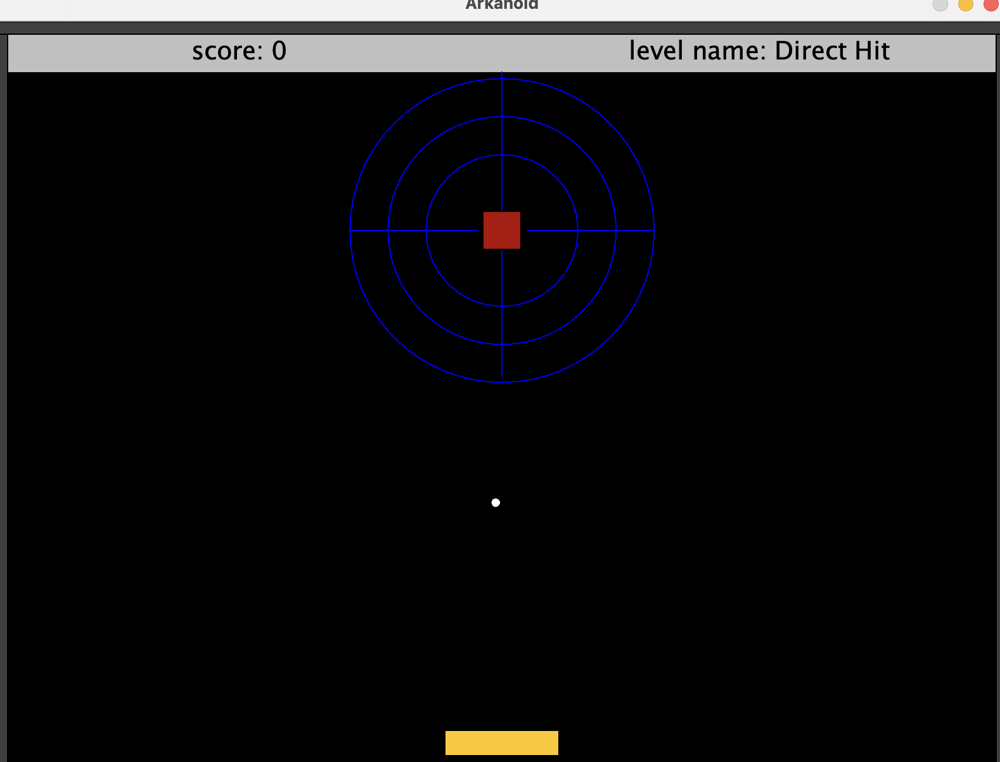
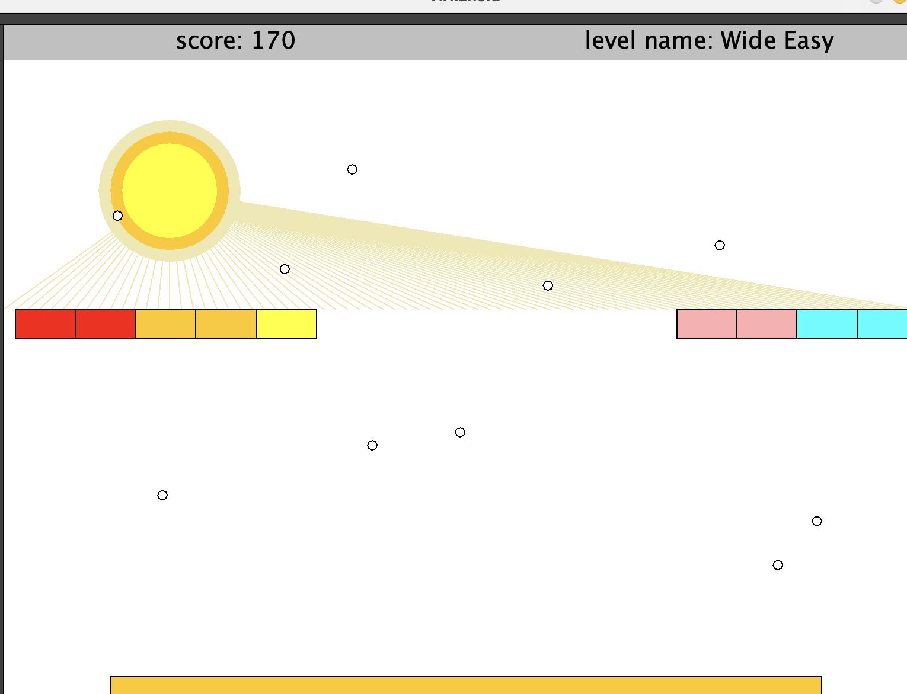
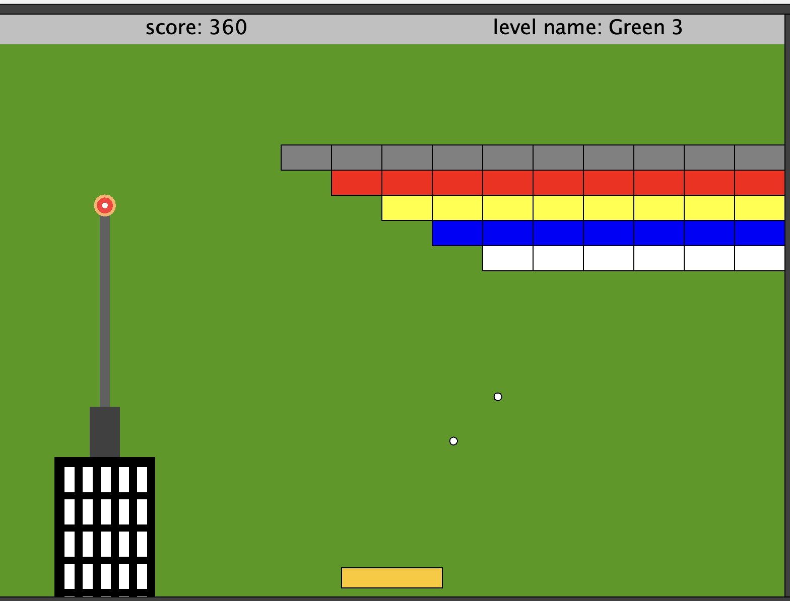
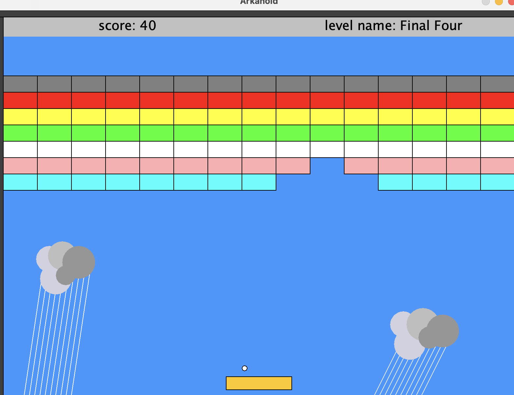
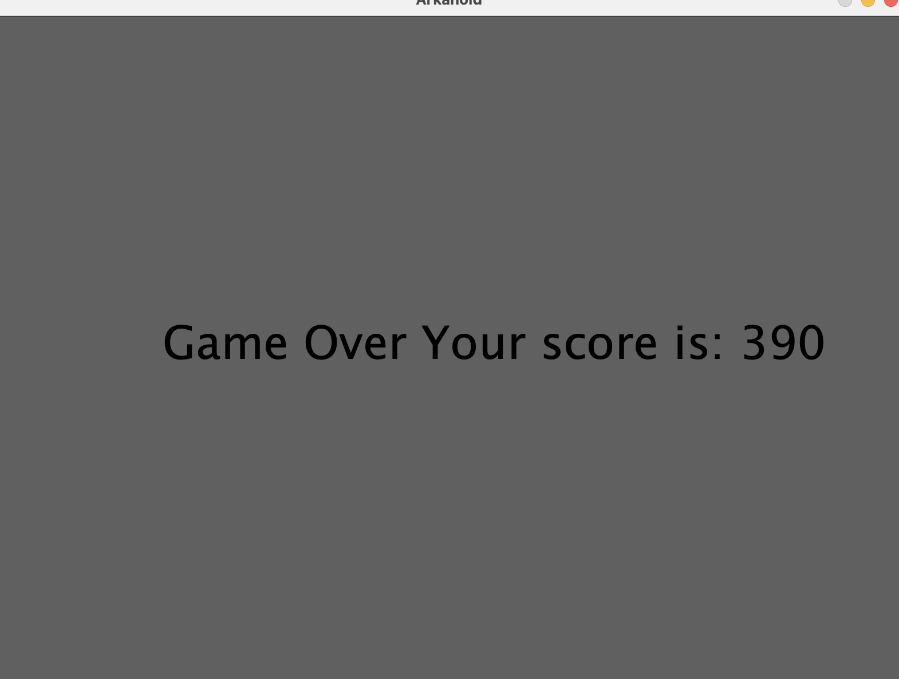

<p align="center">
  
</p>


# Arkanoid-BrickGame 🎮

Arkanoid-BrickGame is a classic brick-breaker game developed in Java as part of my first-year computer science studies. The game recreates the nostalgic experience of arcade classics and demonstrates principles of Object-Oriented Programming (OOP) and design patterns.

## Screenshots 📸

Below are some screenshots of the different stages in the game:

### Stage 1 🌟


### Stage 2 🌟


### Stage 3 🌟


### Stage 4 🌟


### Game Over 💀


Each stage presents new challenges and layouts to keep the gameplay engaging and fun! 🎉

## Project Features 🕹️
- Interactive gameplay with collision detection between the ball and bricks.
- Keyboard control to move the paddle.
- Implementation of OOP principles, including inheritance, polymorphism, and encapsulation.
- Use of design patterns to improve code structure and maintainability.

## Requirements 📋
- Java Development Kit (JDK) version 17 or higher.
- **biuoop-1.4.jar** library (included in the project).

## Installation and Running 🚀
1. Ensure Java is installed on your system by running:
   ```bash
   java -version

2. Navigate to the src folder of the project and compile the Java files:
   ```bash
   javac -cp "../biuoop-1.4.jar" *.java

3. After compilation, run the game with the following command:
   ```bash
   java -cp ".:../biuoop-1.4.jar" Ass6Game

## Additional Notes 📌
- This game serves as a demonstration of in-depth understanding of OOP principles and effective use of design patterns.
- It can be expanded to include additional features, such as difficulty levels, visual enhancements, and more.
- Feel free to explore and customize the code to make it your own! 💡

## Contributions 🤝
Contributions are welcome! If you'd like to improve the game or add new features, please follow these steps:

1. Fork the repository 🍴
2. Create a new branch for your feature or bug fix: `git checkout -b feature-name` 🚀
3. Make your changes and commit them: `git commit -m "Add new feature"` 📝
4. Push to the branch: `git push origin feature-name` 🌐
5. Open a Pull Request 🔄

Thank you for your interest in contributing to Arkanoid-BrickGame! 🙏

---

Enjoy the game and happy coding! 🎉
